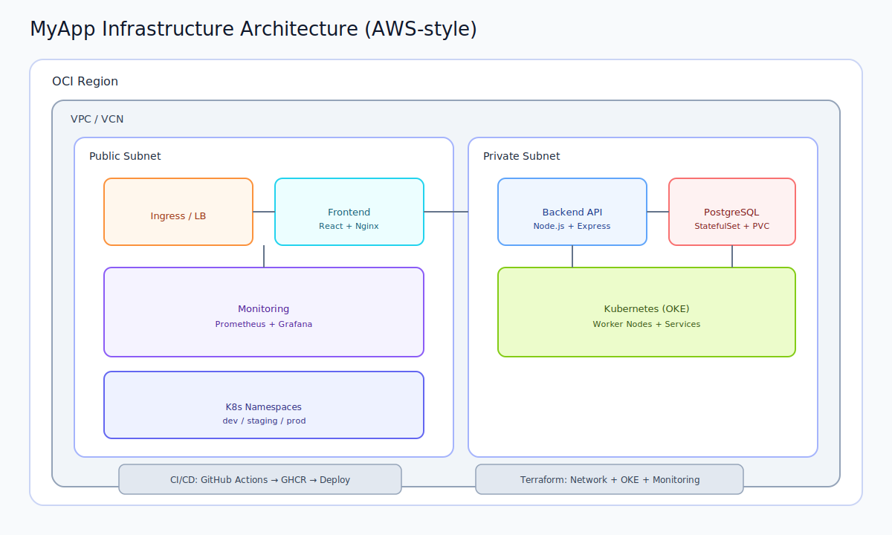

#Platform

Production-ready, cloud-native application. Deployed on Kubernetes with CI/CD and OCI Terraform infrastructure.

## Highlights

- React 18 + Vite frontend
- Node.js + Express backend and microservices
- PostgreSQL StatefulSet
- Redis and Kafka
- Kubernetes with Kustomize overlays
- GitHub Actions CI/CD
- OCI Terraform for production cluster

## Architecture

Ingress → Frontend (Nginx) → Backend (Express) → PostgreSQL + Redis + Kafka + Auth + Notifications



## New to DevOps

See [DEVOPS_BEGINNER_GUIDE.md](DEVOPS_BEGINNER_GUIDE.md) for a step-by-step explanation with real examples and diagrams.
## Quick Start

### Local (Docker Compose)

```bash
docker compose up
```

```bash
docker compose -f docker-compose.yml -f docker-compose.dev.yml up
```

Access:
- Frontend: http://localhost:3000
- Backend: http://localhost:8080
- Health: http://localhost:8080/health
- Auth: http://localhost:8081/health
- Notifications: http://localhost:8082/health
- Redis: localhost:6379
- Kafka: localhost:9092

### Kubernetes (Local with kind)

```bash
kind create cluster --name myapp
chmod +x platform/scripts/bootstrap-cluster.sh
./platform/scripts/bootstrap-cluster.sh
docker compose build
kind load docker-image myapp-frontend:latest --name myapp
kind load docker-image myapp-backend:latest --name myapp
kubectl apply -k platform/k8s/overlays/dev
```

```bash
kubectl port-forward svc/frontend 3000:80 -n myapp-dev
kubectl port-forward svc/backend 8080:80 -n myapp-dev
kubectl port-forward svc/auth-service 8081:80 -n myapp-dev
kubectl port-forward svc/notifications-service 8082:80 -n myapp-dev
```

## Environments

Current setup uses one cluster with namespaces:
- Dev: `myapp-dev`
- Prod: `myapp-production`

Destroying the cluster removes all namespaces.

## Terraform (OCI)

Terraform manages the production cluster in `platform/terraform/oci-prod`.

### Prerequisites

- OCI CLI configured (`~/.oci/config` and `~/.oci/oci_api_key.pem`)
- Backend config from `platform/terraform/oci-prod/backend.hcl.example`
- Variables from `platform/terraform/oci-prod/terraform.tfvars.example`

### Create or Update

```bash
make tf-init-prod
make tf-plan-prod
CONFIRM_APPLY=prod make tf-apply-prod

# Single command: init + apply
CONFIRM_APPLY=prod make tf-recreate-prod
```

### Destroy

```bash
make tf-plan-prod
CONFIRM_DESTROY=prod make tf-destroy-prod
```

To have a separate dev cluster, create a new Terraform folder (e.g. `platform/terraform/oci-dev`) with its own backend state.

## Cost Optimization (Sleep/Wake)

Use these to stop everything when idle and bring it back when needed.

```bash
# Stop workloads, remove public LBs, scale node pool to 0
make sleep-cloud

# Bring node pool back and re-apply dev + prod
make wake-cloud
```

Notes:
- `sleep-cloud` ignores missing services so it can be run repeatedly.
- External IPs change after `wake-cloud`; always re-check Service IPs.

## Operations Shortcuts

```bash
make k8s-status
make deploy-dev
make deploy-prod
make tf-output-prod
```

```bash
kubectl get svc frontend -n myapp-dev
kubectl get svc frontend -n myapp-production
kubectl rollout status deployment/backend -n myapp-production
```

## CI/CD

- Dev CI builds, tests, and deploys to `myapp-dev`.
- Prod Release deploys a selected image SHA to `myapp-production`.
- CI/CD uses a reusable workflow in `.github/workflows/reusable-cicd.yaml` for test → build → deploy.
- Terraform CI validates and formats IaC changes.
- Dependabot keeps dependencies updated weekly.

## Repository Layout

```
services/   Application services
  frontend/            React app
  backend/             Node.js API
  auth-service/        Auth microservice
  notifications-service/ Notifications microservice
platform/   Infrastructure and operations
  k8s/      Kubernetes manifests (base + overlays)
  terraform/ OCI infrastructure
.github/    CI/CD workflows
docs/       Architecture diagrams and flow docs
```

## Operations Playbook

See [OPERATIONS_PLAYBOOK.md](OPERATIONS_PLAYBOOK.md) for day-to-day commands.
- **SecurityContext** — non-root, read-only FS, drop capabilities
- **Pod Security Standards** — restricted mode

### Storage
- **PersistentVolumeClaim** — database storage
- **volumeClaimTemplates** — per-pod PVCs in StatefulSets
- **emptyDir** — temp storage for containers

### Observability
- **Health probes** — startup, readiness, liveness
- **Prometheus metrics** — custom + default
- **Structured logging** — JSON logs with pod metadata

## Onboarding a New Developer

```bash
# 1. Set up their namespace
./platform/scripts/create-dev-namespace.sh alice alice@company.com

# 2. They configure their kubeconfig
aws eks update-kubeconfig --name myapp --region us-east-1

# 3. They switch to their namespace
kubectl config set-context --current --namespace=dev-alice

# 4. They run the app locally
docker compose -f docker-compose.yml -f docker-compose.dev.yml up
```

## CI/CD Pipeline Flow

```
PR opened → Test (unit tests) → Security scan (Trivy)
                                              │
                                    merge to main
                                              │
                                    Build Docker images
                                    Push to GHCR
                                    Tag with commit SHA
                                              │
                                    Deploy to Dev
                                    Rollout status check
                                    Smoke test
                                              │
                                    Deploy to Production
                                    Rollout status check
                                    Post-deploy verification
```

## Common Operations

```bash
# View all resources
kubectl get all -n myapp-production

# Check external IPs
kubectl get svc frontend -n myapp-dev
kubectl get svc frontend -n myapp-production

# Check logs
kubectl logs -f deployment/backend -n myapp-production

# Scale manually
kubectl scale deployment backend --replicas=5 -n myapp-production

# Rollback a bad deploy
kubectl rollout undo deployment/backend -n myapp-production
kubectl rollout history deployment/backend -n myapp-production

# Debug a pod
kubectl exec -it deployment/backend -n myapp-production -- sh
kubectl describe pod <pod-name> -n myapp-production

# Port forward for debugging
kubectl port-forward svc/backend 8080:80 -n myapp-production
kubectl port-forward svc/monitoring-grafana 3001:80 -n monitoring

# View HPA status
kubectl get hpa -n myapp-production

# View resource usage
kubectl top pods -n myapp-production
kubectl top nodes
```

##  WHD

- Docker multi-stage builds, layer caching, security
- K8s Deployments vs StatefulSets
- Service types (ClusterIP, Headless, NodePort, LoadBalancer)
- Ingress routing, TLS termination
- Health probes (startup vs readiness vs liveness)
- Graceful shutdown (preStop hooks, SIGTERM handling)
- HPA scaling policies and metrics
- PodDisruptionBudgets
- RBAC (Roles, ClusterRoles, RoleBindings)
- NetworkPolicies (default-deny, microsegmentation)
- ConfigMaps vs Secrets
- Kustomize (base/overlays pattern)
- CI/CD with GitHub Actions
- Image tagging strategies (SHA vs semver vs latest)
- Rolling updates (maxUnavailable, maxSurge)
- Rollback strategies
- Resource requests vs limits
- Namespace isolation for teams
- Monitoring with Prometheus
- Pod security contexts
