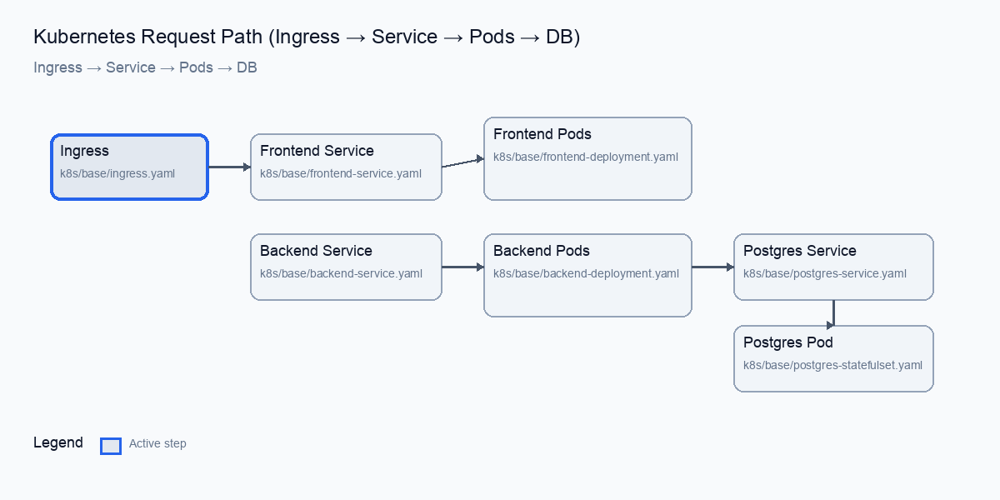

# Request Path Diagram (File-by-File)

## End-to-End Flow



```text
Client
  │
  ▼
Ingress (k8s/base/ingress.yaml)
  │  routes /api and /health to backend Service
  │  routes / to frontend Service
  ▼
Service (k8s/base/backend-service.yaml or k8s/base/frontend-service.yaml)
  │  selects pods by labels
  ▼
Pods (k8s/base/backend-deployment.yaml or k8s/base/frontend-deployment.yaml)
  │  backend talks to database
  ▼
Database Service (k8s/base/postgres-service.yaml)
  │  headless DNS for StatefulSet
  ▼
Database Pod (k8s/base/postgres-statefulset.yaml)
```

## How Each Manifest Participates

### Traffic Entry and Routing
- k8s/base/ingress.yaml  
  Defines host + path routing. Sends /api and /health to backend Service, and / to frontend Service.

### Services (Stable Networking)
- k8s/base/backend-service.yaml  
  Stable DNS name `backend` for backend pods.
- k8s/base/frontend-service.yaml  
  Stable DNS name `frontend` for frontend pods.
- k8s/base/postgres-service.yaml  
  Headless Service for stable DNS to PostgreSQL StatefulSet pod.

### Workloads (Pods)
- k8s/base/backend-deployment.yaml  
  Backend pods, probes, resources, and env wiring from ConfigMap and Secret.
- k8s/base/frontend-deployment.yaml  
  Frontend pods, probes, and resources.
- k8s/base/postgres-statefulset.yaml  
  PostgreSQL pod with persistent volume claim.

### Configuration and Identity
- k8s/base/configmap.yaml  
  Non-secret app settings.
- k8s/base/secrets.yaml  
  DB credentials for backend and PostgreSQL.
- k8s/base/service-accounts.yaml  
  Separate service accounts for frontend and backend pods.
- k8s/base/namespace.yaml  
  Namespace for isolation.

### Availability and Scaling
- k8s/base/backend-hpa.yaml  
  Autoscaling rules for backend pods.
- k8s/base/frontend-hpa.yaml  
  Autoscaling rules for frontend pods.
- k8s/base/backend-pdb.yaml  
  Prevents backend from dropping below 1 pod during disruptions.

### Network Restrictions
- k8s/base/network-policies.yaml  
  Allows only required traffic paths: ingress → frontend/backend → postgres.

## How Overlays Change the Flow

- k8s/overlays/dev/kustomization.yaml  
  Disables Ingress, reduces replicas, and removes HPA for local dev.
- k8s/overlays/staging/kustomization.yaml  
  Uses staging domain and image tags, keeps Ingress on.
- k8s/overlays/prod/kustomization.yaml  
  Production domain, resource tuning, optional LoadBalancer frontend Service.
