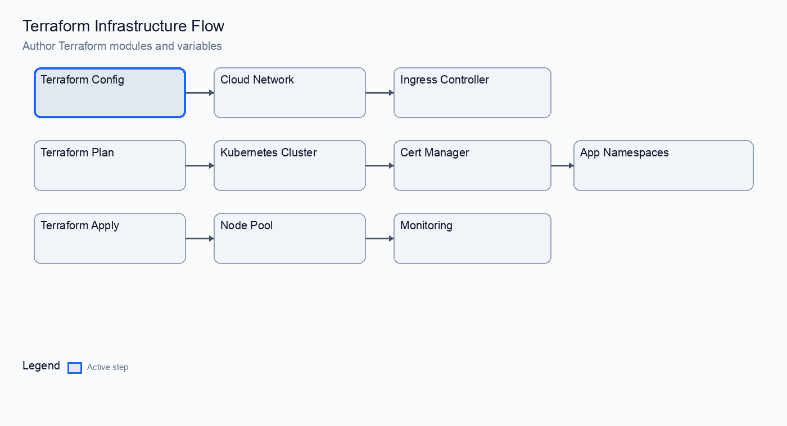
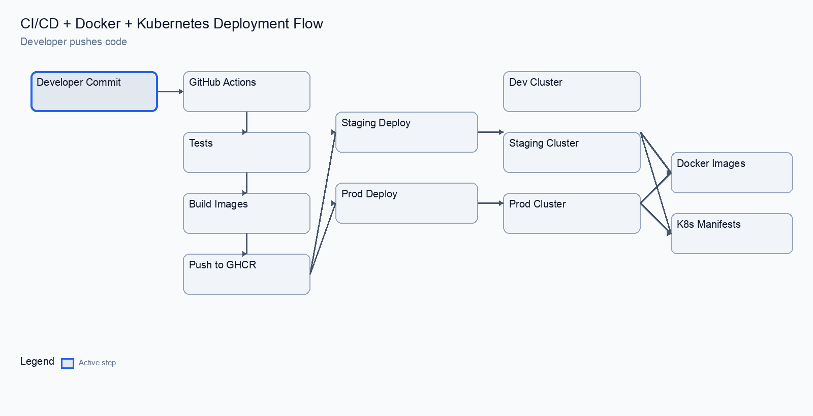

# Request Path Diagram (File-by-File)

## End-to-End Flow


## Terraform and CI/CD Animations




```text
Client
  │
  ▼
Service (platform/k8s/base/frontend-service.yaml)
  │  routes traffic to frontend pods
  ▼
Pods (platform/k8s/base/frontend-deployment.yaml)
  │  frontend calls backend Service
  ▼
Service (platform/k8s/base/backend-service.yaml)
  │  selects backend pods by labels
  ▼
Pods (platform/k8s/base/backend-deployment.yaml)
  │  backend talks to database
  ▼
Database Service (platform/k8s/base/postgres-service.yaml)
  │  headless DNS for StatefulSet
  ▼
Database Pod (platform/k8s/base/postgres-statefulset.yaml)
```

## How Each Manifest Participates

### Services (Stable Networking)
- platform/k8s/base/backend-service.yaml  
  Stable DNS name `backend` for backend pods.
- platform/k8s/base/frontend-service.yaml  
  Stable DNS name `frontend` for frontend pods.
- platform/k8s/base/postgres-service.yaml  
  Headless Service for stable DNS to PostgreSQL StatefulSet pod.

### Workloads (Pods)
- platform/k8s/base/backend-deployment.yaml  
  Backend pods, probes, resources, and env wiring from Secret.
- platform/k8s/base/frontend-deployment.yaml  
  Frontend pods, probes, and resources.
- platform/k8s/base/postgres-statefulset.yaml  
  PostgreSQL pod with persistent volume claim.

### Configuration and Identity
- platform/k8s/base/secrets.yaml  
  DB credentials for backend and PostgreSQL.
- platform/k8s/base/namespace.yaml  
  Namespace for isolation.

### Availability and Scaling
- platform/k8s/base/backend-hpa.yaml  
  Autoscaling rules for backend pods.
- platform/k8s/base/frontend-hpa.yaml  
  Autoscaling rules for frontend pods.
- platform/k8s/base/backend-pdb.yaml  
  Prevents backend from dropping below 1 pod during disruptions.

## How Overlays Change the Flow

- platform/k8s/overlays/dev/kustomization.yaml  
  Reduces replicas for local dev.
- platform/k8s/overlays/prod/kustomization.yaml  
  Production domain, resource tuning, optional LoadBalancer frontend Service.
